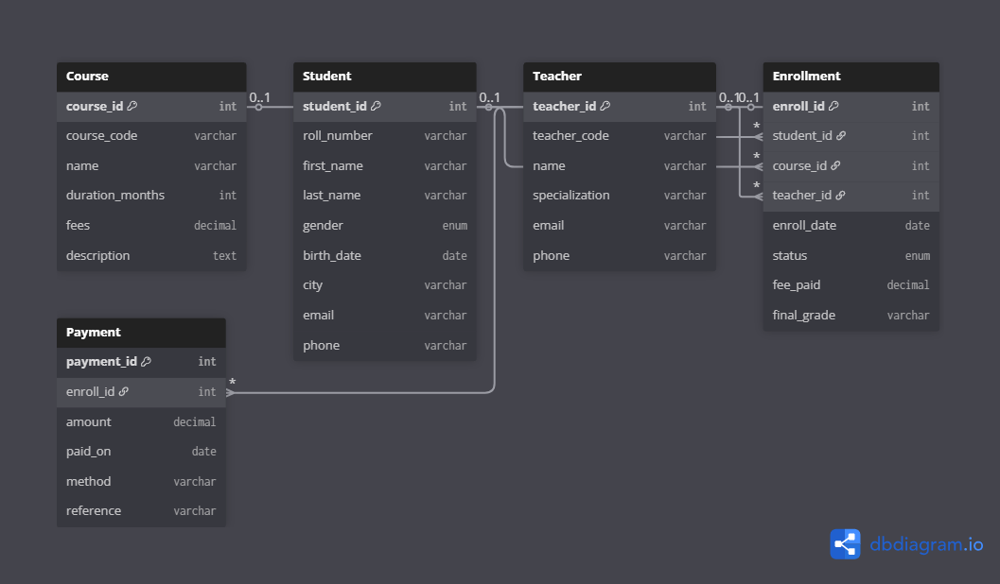

# 🧑‍🎓 Student Course Management System – SQL Project

This project is a complete SQL relational database designed to manage **Students**, **Courses**, **Teachers**, **Enrollments**, and **Payments** for an educational institution.  
It includes the full SQL script, ER diagram, and exported output files.

---

## 📂 Project Structure

Student-Course-Management-System/
│── student-course-management-system.sql
│── outputs/
│ ├── student table.csv
│ ├── course table.csv
│ ├── enrollment table.csv
│ ├── teacher table.csv
│ ├── MySQL Screenshot 1.png
│ ├── MySQL Screenshot 2.png
│ ├── MySQL Screenshot 3.png
│── ERD.png
│── README.md

yaml
Copy code

---

## 🧩 ER Diagram

(Add your ERD.png to the repository root, then this image will show👇)



---

## 🛠️ How to Run the Project

1. Install **MySQL** or use an online SQL editor (DB-Fiddle, PhpMyAdmin, etc.)
2. Run the SQL script:

```sql
source student-course-management-system.sql;
This will automatically:

✔ Create the database
✔ Create all tables
✔ Insert sample data

📊 Example SQL Query (JOIN)
sql
Copy code
SELECT 
    s.first_name,
    s.last_name,
    c.name AS course,
    t.name AS teacher,
    e.enroll_date
FROM Enrollment e
JOIN Student s ON e.student_id = s.student_id
JOIN Course c ON e.course_id = c.course_id
JOIN Teacher t ON e.teacher_id = t.teacher_id;
🎯 Features of This SQL Project
Fully designed relational schema

Primary & Foreign Keys

Constraints (UNIQUE, CHECK, AUTO_INCREMENT)

ER Diagram

Sample data insertion

Exported CSV outputs

JOIN, GROUP BY, and subquery examples

📁 Outputs Included
All exported results and screenshots are stored in the outputs/ folder:

CSV table exports

Screenshots from MySQL overviews

Verification outputs

🧠 What I Learned
How to design an SQL database using ER modeling

How to apply relationships using PK/FK

Writing JOIN queries and constraints

Importing/exporting data with CSV

Documenting a project on GitHub

🚀 Future Enhancements
Add Attendance table

Build a front-end UI

Add admin authentication

Create a dashboard using Power BI

Convert SQL into a REST API

⭐ Thank you for viewing my project!
Feel free to give feedback or suggestions 😊
